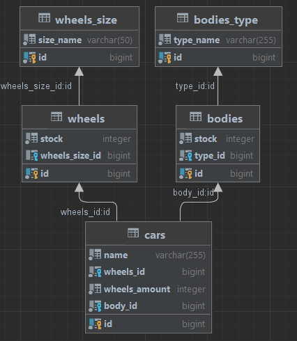

# Тестовое задание для М.Тех

[Текст задания](https://disk.mvideo.ru/s/pLjxYd2y4BBm5Ff)

## Описание

Реализованы все эндпоинты в соответствии с заданием. Дполнительно для всех эндпоинтов, возвращающих несколько элементов, добавлена пагинация.

Дополнительные функции:
- Отслеживание количества деталей на складе: при недостатке деталей возвращается соответствующее сообщение с ошибкой.
- Использование отдельных таблиц для хранения типов колес и кузовов, что позволяет свободно добавлять новые типы при необходимости.

## Физическая схема базы данных



## Тестирование

Приложение протестировано с использованием Postman. [Коллекция тестов Postman](./postman.json).

## Запуск в Docker

Все компоненты приложения упакованы в Docker-контейнеры и объединены с помощью Docker Compose.

### Сборка и запуск контейнеров

```bash
docker-compose up
